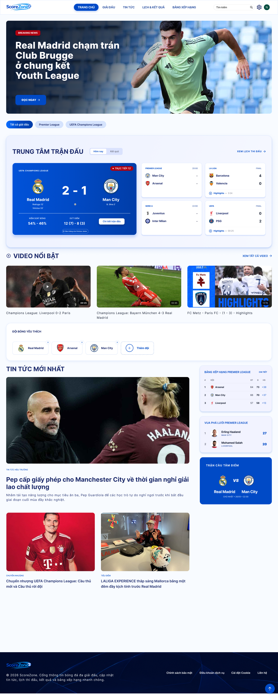

# ⚽ ScoreZone

> A multi-competition football information platform — from research-driven UI/UX design to front-end implementation.

[](https://www.figma.com/design/kBgMkOeeR3Jgjip1Z3V6QJ/IE106-Nhom12?node-id=0-1&t=yrXtAbZcLh0pV7CO-1)

[](https://www.figma.com/proto/kBgMkOeeR3Jgjip1Z3V6QJ/IE106-Nhom12?node-id=2262-3324&p=f&t=F1KqQUkYaTC85cvd-0&scaling=min-zoom&content-scaling=fixed&page-id=0%3A1&starting-point-node-id=2262%3A3324)

[](#development-status)

ScoreZone started as an **IE106 – User Interface Design** academic project at UIT and is now being continued as a personal front-end project.

The goal is simple: bring fixtures, results, standings, news, highlights, and competition information into one structured football platform.

---

## 👀 Preview

> Add 2–4 strong screenshots here. Prioritize the homepage, match page, news page, and standings.

```text
assets/
└── screenshots/
    ├── home.png
    ├── match-detail.png
    ├── news.png
    └── standings.png
```

<!-- Example:

-->

---

## ✨ Overview

Football information is often fragmented across social media, league websites, and news platforms. Users have to move between multiple sources to follow matches, results, standings, and news.

**ScoreZone** explores how these contents can be organized into one consistent experience.

### Core areas

- 🏠 Home
- 🏆 Competitions & clubs
- 👤 Player profiles
- 📰 News & video highlights
- 📅 Fixtures & results
- 📊 Standings
- 🔎 Search
- 👤 User account

---

## 🎯 My Contribution

This project is being developed from the original academic UI/UX work into a personal front-end project.

My main focus includes:

- UI/UX design and visual direction
- Information architecture and user flows
- Figma wireframes and high-fidelity screens
- Design system and reusable UI components
- Interaction states: dropdowns, overlays, popups, hover cards, toasts
- Translating the Figma design into HTML/CSS
- Continuing the implementation toward JavaScript and React

> The original project was completed as part of an academic group assignment. This repository focuses on my continued development of the project.

---

## 🔍 Research → Design

The original design process was based on an online survey with **79 respondents**, followed by comparison with existing football platforms including J.LEAGUE, UEFA Champions League, and LaLiga.

| Research insight | Design response |
|---|---|
| Social media is a major football information source (82.3%) | Make ScoreZone useful for structured information lookup |
| News & highlights are the most preferred content (74.7%) | Prioritize news and highlights on the homepage |
| Advanced filtering is highly requested (50.6%) | Use clear filters and chips for competitions/data |
| Complex menus are a major reason for leaving a site (32.9%) | Simplify navigation and use clear hierarchy |
| Bold/Sporty style is preferred (55.7%) | Use a clean sporty visual language with controlled emphasis |

The research also informed the use of a blue visual direction, Hero Banner layout, clear typography, and restrained animation.

---

## 🎨 Design

### Design System

- **Primary:** `#004AC6`, `#2563EB`
- **Background:** `#F8FBFF`
- **Surface:** `#FFFFFF`
- **Text:** `#1D2B6B`
- **Font:** Inter
- **Icons:** Icons8

The system uses reusable colors, typography, spacing, navigation patterns, cards, filters, and feedback states to keep the interface consistent across screens.

### High-Fidelity UI

The Figma design covers:

- Homepage
- Competition & club pages
- Player profiles
- News & video pages
- Fixtures & results
- Match details
- Standings
- Search
- User profile
- Authentication flows

---

## 🤖 Contextual AI / UX Concepts

AI was explored as part of the user experience rather than as a separate chatbot.

Examples from the prototype:

- Search suggestions when no results are found
- Quick article summaries
- **AI Match Insight** for interpreting match data

> These are currently **UX concepts in the prototype**, not production AI features.

---

## 🛠 Tech Stack

### Design
- Figma
- Icons8

### Front-end
- HTML5
- CSS3
- JavaScript
- React *(planned)*

### Tools
- Git
- GitHub
- VS Code

---

## 🚧 Development Status

| Stage | Status |
|---|---|
| Research & analysis | ✅ Complete |
| Information Architecture | ✅ Complete |
| Wireframes | ✅ Complete |
| Design System | ✅ Complete |
| High-Fidelity UI & Prototype | ✅ Complete |
| HTML/CSS implementation | 🚧 In progress |
| JavaScript | ⏳ Planned |
| React | ⏳ Planned |
| Real football data / backend | ⏳ Future |
| Deployment | ⏳ Future |

The current goal is to progressively turn the Figma prototype into a working web application.

---

## 🗂 Repository Structure

```text
ScoreZone/
├── README.md
├── docs/
│   ├── research/
│   ├── flows/
│   ├── wireframes/
│   └── design-system/
├── assets/
│   └── screenshots/
└── src/
```

Detailed research and academic documentation can live inside `docs/` rather than making the main README overly long.

---

## 🔗 Links

- 🎨 **Figma Design:** [Open Figma](YOUR_FIGMA_LINK)
- 🖱️ **Interactive Prototype:** [Open Prototype](YOUR_PROTOTYPE_LINK)
- 📄 **Project Report:** [View Report](YOUR_REPORT_LINK)
- 🎥 **Demo:** [Watch Demo](YOUR_DEMO_LINK)

---

## 📌 Current Limitations

- The original prototype focuses on desktop screens.
- Real football data and backend services are not implemented yet.
- The prototype has not undergone a large representative usability test.
- Some secondary screens need further refinement during development.

---

## 🔮 Next Steps

1. Complete the HTML/CSS implementation.
2. Add JavaScript interactions and UI states.
3. Rebuild reusable components with React.
4. Connect real football data through an API.
5. Add personalization such as followed teams, saved articles, and notifications.
6. Improve responsive and accessibility support.
7. Deploy the application.

---

## 🎓 Academic Context

**IE106 – User Interface Design**  
University of Information Technology (UIT) — VNU-HCM

ScoreZone was originally developed as a Group 12 academic project and is now being maintained and extended as a personal front-end learning project.

---

## 📄 License

The project originated as an academic project for IE106 – User Interface Design.
