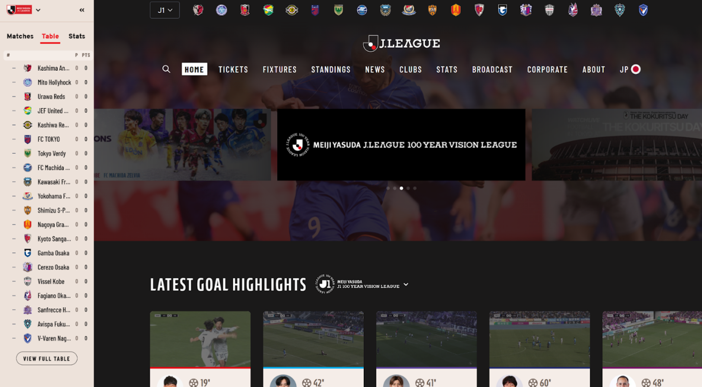
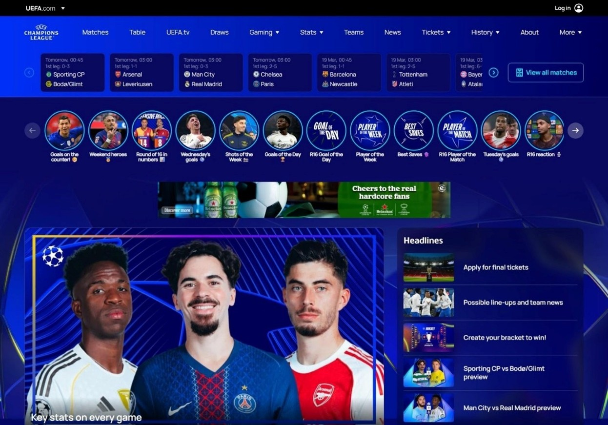
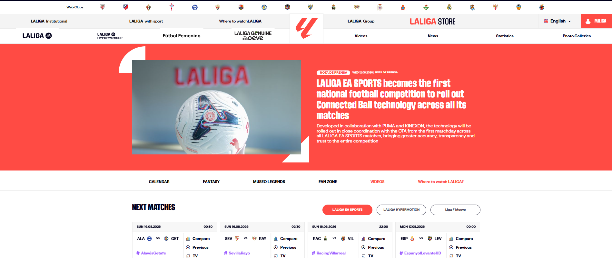

# Competitive Analysis

## 1. Overview

After the user survey, the ScoreZone project reviewed existing football platforms to understand how established products organize large amounts of football information.

The purpose was **not to copy existing interfaces**, but to compare:

- Homepage structure
- Navigation and information architecture
- Fixtures and match information
- Standings
- News and highlights
- Club and player profiles
- Statistics and data visualization
- Visual identity
- Content density and hierarchy

The main references were:

1. **J.LEAGUE**
2. **UEFA Champions League**
3. **LaLiga**

Additional football and sports platforms such as **Premier League, Manchester City F.C., and ESPN** were also referenced for comparison of competition information, club/player profiles, fixtures, scores, and match data.

---

## 2. Comparison Framework

The three primary platforms were evaluated from two perspectives:

### What can be learned?

- How important information is surfaced
- How football content is grouped
- How match and competition data is presented
- How visual identity creates a sports-oriented experience
- How statistics can be made more understandable

### What should be avoided?

- Overly dense layouts
- Deep or complicated navigation
- Too many competing content blocks
- Excessive use of small cards/carousels
- Visual elements that distract from the main task

The goal was to find a balance between **rich football content** and **fast information retrieval**.

---

## 3. J.LEAGUE

### What was studied

The analysis focused on:

- Homepage structure
- Competition content
- Standings
- Highlights
- Navigation
- Information blocks

J.LEAGUE presents a wide range of competition information, including fixtures, standings, club information, news, statistics, and video highlights.

### Strengths to learn from

- Important competition information is available directly from the homepage.
- Highlights and video content are easy to discover.
- The platform combines different types of football content in one place.
- The overall experience emphasizes current and frequently updated information.

### Limitations to avoid

The research identified a relatively large sidebar and many information blocks competing for attention. The darker visual treatment can also create a heavier visual impression.

### Lesson for ScoreZone

> **A content-rich homepage needs a clear priority order.**

ScoreZone therefore aims to provide multiple types of football information while giving stronger visual priority to the content users are most likely to need quickly.

---

## 4. UEFA Champions League

### What was studied

The analysis focused on:

- Visual identity
- Homepage content hierarchy
- Match cards
- Featured content
- Navigation
- Moments / highlights
- Bracket view
- Headlines

### Strengths to learn from

- Strong and recognizable visual identity
- Dynamic presentation of football content
- Prominent match cards
- Attractive content cards
- Bracket view provides a visual way to understand competition progress

### Limitations to avoid

The interface contains many navigation items, deeper dropdowns, carousels, and small content cards. These patterns can increase the amount of information users need to scan.

### Lesson for ScoreZone

> **A dynamic sports interface still needs simple navigation.**

ScoreZone keeps the sports visual language while using clearer grouping and shorter navigation paths.

---

## 5. LaLiga

### What was studied

The analysis focused on:

- Statistics
- Player profiles
- Data visualization
- Match information
- Next Matches
- Navigation
- Where to Watch
- Player comparison

### Strengths to learn from

- Rich statistical information
- Detailed player profiles
- Use of charts for data interpretation
- Player comparison through radar charts
- Multiple competition and match information modules

### Limitations to avoid

The research identified a multi-level header, dense modules, strong visual accents, and advertising areas that can compete for attention.

Some statistical areas also require additional navigation to locate the desired information.

### Lesson for ScoreZone

> **Rich data should be paired with filtering and clear hierarchy.**

ScoreZone therefore treats statistics as structured information rather than simply displaying more data on the screen.

---

## 6. Cross-Platform Comparison

| Platform | Main strength | Limitation to avoid | Lesson for ScoreZone |
|---|---|---|---|
| **J.LEAGUE** | Fresh competition content, standings, highlights | Dense homepage and competing information blocks | Prioritize content clearly |
| **UEFA Champions League** | Strong visual identity, match cards, dynamic content | Deep navigation, many cards/carousels | Keep navigation simple |
| **LaLiga** | Statistics, player profiles, data visualization | Dense modules and multi-level navigation | Pair rich data with hierarchy and filtering |

---

## 7. Design Direction for ScoreZone

The competitive research led to a combined direction:

**J.LEAGUE's information freshness**  
+ **UEFA Champions League's visual impact**  
+ **LaLiga's data depth**

↓

**A more compact and easier-to-scan football information experience.**

This direction was combined with the findings from the 79-response user survey rather than being applied independently.

### Resulting principles

#### 01 — Content richness without information overload

ScoreZone should provide multiple football content types, but not give every module the same visual weight.

#### 02 — Clear navigation

Users should be able to move between competitions, matches, news, standings, clubs, and players without navigating through unnecessarily deep menus.

#### 03 — Strong sports identity

The interface should feel energetic and football-oriented while maintaining readability and hierarchy.

#### 04 — Data should be understandable

Statistics, standings, and match data should be organized into scannable blocks and supported by filtering or visual summaries where appropriate.

#### 05 — Prioritize fast information retrieval

The platform is designed around the user's need to quickly find relevant football information rather than simply displaying the maximum amount of available data.

---

## 8. From Competitive Research to UI

The competitive analysis directly influenced several ScoreZone decisions:

| Observation | ScoreZone response |
|---|---|
| Football platforms contain many content types | Group content into clear sections |
| Dense homepages can compete for attention | Establish stronger visual hierarchy |
| Deep navigation increases cognitive load | Keep primary navigation concise |
| Match cards are useful for quick scanning | Use structured match information cards |
| Rich statistics can become overwhelming | Organize data into focused sections |
| Strong sports branding improves identity | Use a controlled Bold/Sporty visual direction |
| Highlights are important football content | Give news and video content strong visibility |
| Competition data is central to football websites | Provide dedicated competition, fixtures, and standings areas |

---

## 9. Key Takeaway

The goal of the competitive research was not to determine which existing football website was "best".

Instead, the analysis helped identify a design space for ScoreZone:

> **Keep the information richness of established football platforms, but organize it around clearer hierarchy, simpler navigation, and faster scanning.**

This principle became one of the foundations for the ScoreZone information architecture, wireframes, and high-fidelity UI.

---

## 10. Related Documentation

- [User Survey](survey.md)
- [Design System](../design-system/)
- [Wireframes](../wireframes/)
- [ScoreZone README](../../README.md)
